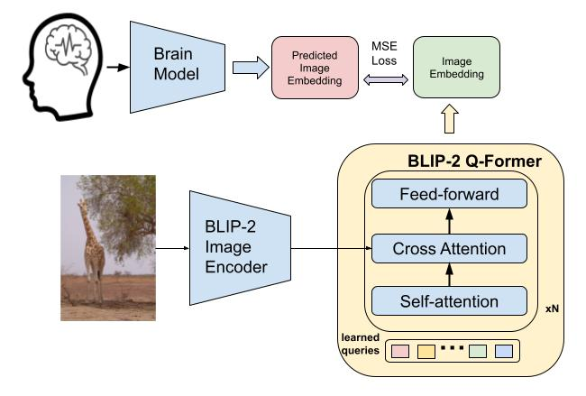
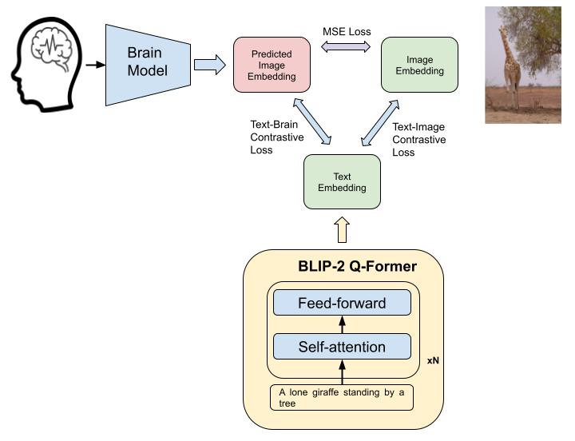
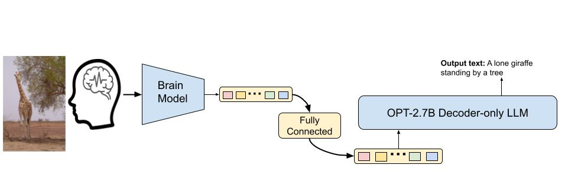

# Neuro decoding with Language Models

This folder contains the pipeline code for decoding fMRI signals into meaningful captions.

### Extracting Features

This project uses the [BLIP-2](https://arxiv.org/abs/2301.12597) vision-language model. Extract the Q-Former features from images using:

```bash
python alignment/blip2_extract_vision_features.py --gpu 0 --batch_size 128 --embed_type vision
```

The process works as follows:

1. Images are passed through the Vision encoder
2. The encoded features are processed by Q-Former
3. Final output is a query representation of size $32\times768$

### Alignment training

After extracting image representations, train the `BrainToPrefix` model to map fMRI signals to BLIP-2 embeddings using `Ridge Regression`.




```bash
python alignment_training.py --subj 1 --config configs/ridge_regression_pt.yaml
```

### Contrastive Learning

The second training stage implements contrastive learning. The model is initialized from the ["Salesforce/blip2-itm-vit-g"](https://huggingface.co/Salesforce/blip2-itm-vit-g) checkpoint, as `Blip2ForConditionalGeneration` doesn't include projection weights for retrieval. A brain projection linear layer is added to the model.

Process:
1. Load and convert `BrainToPrefix` weights to trainable PyTorch Parameters
2. Train the contrastive model using fMRI signals, BLIP-2 image embeddings, and captions as shown below:



```bash
python contrastive_training.py --config configs/ridge_regression_pt.yaml --memory_size 1 --savename savename --subj 1
```

### Inference

Caption generation follows this pipeline:



During inference, the model performs both image-brain and text-brain retrievals. The retrieval logits and ground truth labels are stored in `results/*pth` files. To visualize the results:
```python
img_retrieval_logits, labels = torch.load('results/pt_type1_mem1_image_fwd.pth')
sorted_ = torch.argsort(img_retrieval_logits, axis=1)
i = 0 # random index
indices = sorted_[i]
top5 = list(indices.numpy())[::-1][:5]
gt_label = labels[i]
```

Run inference using:
```bash
python inference.py --type 1 --memory_size 1 --model_path path_to_ckpt_file --config configs/ridge_regression_pt.yaml --savename savename --subj 1
```

For ROI optimal inference:
```bash
python roi_optimal_inference.py --memory_size 1 --subj 1 --config configs/ridge_regression_pt.yaml
```

Generated captions can be found in CSV files within the `results` folder.
